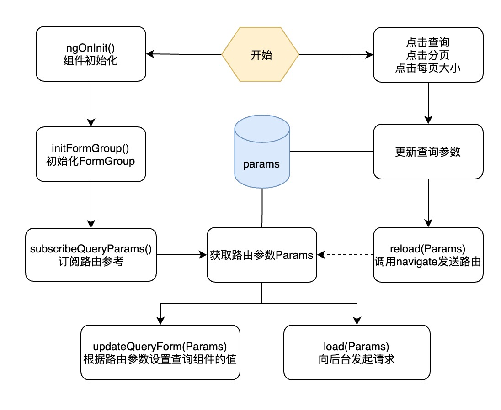

组件初始化

-----

## 初始化流程

组件初始化流程图如下：



1. 在订阅路由前初始化`FormGroup`防止在渲染V层时出现找不到名称为XXX的FormControl的错误。

示例代码：

```typescript
  reload(params: Params, route: ActivatedRoute): Promise<boolean> {
    const queryParams = CommonService.convertToRouteParams(params);
    return this.router.navigate(['./'],
      {
        relativeTo: route,
        queryParams: queryParams,
      }).then();
  }
```


## 查询组件

由于路由参数`Params`实际可以由用户刷新页面后获取，所以其类型就是固定的`string`。此时就要求查询组件可以有效的处理`string`类型的数字了。

比如路由发送过来的`1`是发送的`'1'`，而不是`1`。处理的示例代码如下：

```typescript
  writeValue(value: number | string): void {
    let nationalityId = value;
    if (typeof value === 'string') {
      nationalityId = +value;
    }
    // 判断是否有有效的integer，防止空字符串带来的NaN错误
    if (!Number.isInteger(nationalityId)) {
      nationalityId = null;
    }
    this.nationalityId.setValue(nationalityId);
  }
```


